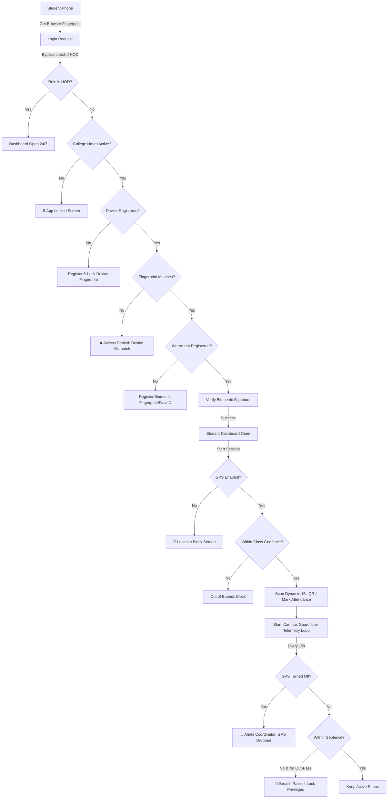

# GeoAttend — Comprehensive A to Z Project Guide
### IoT-Enabled Smart Attendance Management System with Real-Time Geofencing, Cryptographic Device Fingerprinting, and Live Telemetry Analytics

---

## 📖 1. The Core Vision
Traditional attendance management (roll calls, paper sheets, RFID cards, or static QR codes) suffers from one fatal flaw: **it does not guarantee physical presence.** Students share QR screenshots, scan proxy RFID cards for friends, or register attendance and immediately sneak out of class (bunking). 

**GeoAttend** is a foolproof, zero-proxy attendance and security monitoring ecosystem. It locks the student to their **exact physical location**, their **registered mobile hardware**, and their **native biometric identity (Face ID/Fingerprint)**. It doesn't just record attendance once; it continuously monitors presence on campus during college hours, ensuring true administrative accountability.

---

## ⚙️ 2. System Architecture & Flow

---

## 🛠️ 3. A to Z Features (All 11 Modules)

### 1. UI Pill Icon Badges (Visual Tracking)
Instead of text, the dashboard uses modern, responsive pill badges:
*   **Battery Badges:** Visual color indicators representing student power status (🔵 Charging Bolt, 🟢 Good >50%, 🟡 Low 20–50%, 🔴 Critical <20%).
*   **Location Dots:** Live status indicators. A pulsing 🟢 Green dot indicates active telemetry (GPS coordinates refreshed within 3 mins). A pulsing 🔴 Red dot warns that the student's GPS has dropped.

### 2. Location GPS Gate (No GPS = No Entry)
To prevent students from disabling GPS to hide their coordinates:
*   Upon loading the student or teacher portal, the app checks for browser geolocation access.
*   If denied, it locks the page with a clean instructions screen detailing how to grant location access. The login page itself remains fully open to HODs.

### 3. College Hours Auto-Lock
*   The student portal connects to the server clock.
*   Outside operational hours (9:00 AM – 4:00 PM), students and teachers cannot log in or view the portal. Instead, they see a clean locked screen: *“GeoAttend is Closed. Returns tomorrow at 9:00 AM.”*
*   If a student keeps their portal open, a background script re-evaluates the status every 60 seconds and locks the UI automatically at 4:00 PM.

### 4. Holiday Mode (HOD Manual Override)
*   If a holiday is declared, the HOD can toggle **Holiday Mode** in their settings panel.
*   This immediately overrides standard schedules and locks the application for all students.
*   The HOD portal remains open 24/7 so they can toggle it off at any time.

### 5. Stable Browser Fingerprint Binding
*   Unlike typical cookie-based tracking, GeoAttend generates a unique, stable hardware signature based on screen specs, timezone, browser configurations, and concurrency.
*   Once a student logs in on a phone, their account is permanently bound to that hardware fingerprint. Clearing history or cookie storage will not bypass the lockout.

### 6. Permanent Cryptographic Biometric Lock
*   Upon registration, the student binds their fingerprint or Face ID using browser WebAuthn cryptographics.
*   Once bound, any attempt to register a new biometric ID on that account is blocked. Only an HOD or Coordinator has the authority to reset device bindings.

### 7. Fake GPS & Spoofing Protection
*   **Speed Checks:** If a student's coordinate jumps further than 1000m in less than 60 seconds, it triggers a warning.
*   **Accuracy Checks:** Spoofing applications often return exact `0m` or fake `5000m+` accuracy levels, which are automatically flagged.
*   **Static Detection:** Pinpoints users feeding frozen coordinates to bypass movement alerts. Suspicious telemetry marks the student as **LOCATION SUSPECT** on the dashboard.

### 8. GPS Dropout Warning & Escalation
*   If a student turns off their GPS during an active class period, the server detects the missing telemetry for over 3 minutes.
*   This triggers a `GPS_DROPPED` alert on the Coordinator's dashboard.
*   The Coordinator can click **Escalate to HOD** to push the security alert directly to the HOD's dashboard.

### 9. Auto-Closing Sessions
*   If a teacher starts an attendance session and forgets to close it, it is automatically terminated.
*   Teachers enter the active duration in minutes (e.g. 5, 10, 45 mins) when starting a class. The server auto-closes the session once the timer expires.

### 10. Half-Day Attendance Calculation
*   System automatically calculates full/half-day indicators based on physical presence:
    *   🟢 **Full Day:** Present and active within campus boundaries for ≥ 75% of operational hours.
    *   🟡 **Half Day:** Active for 30% to 74% of operational hours.
    *   🔴 **Absent:** Less than 30% active presence.

### 11. Student Movement Timeline
*   HODs can click any student's name to view a detailed, step-by-step movement log:
    *   *10:00 AM — Attendance Marked (Inside Campus)*
    *   *10:08 AM — GPS Confirmed*
    *   *10:20 AM — Left Class Area (Moved 65m away)*
    *   *10:24 AM — Returned to Class*
    *   *10:45 AM — Exited Campus Boundary*
    *   *11:00 AM — Session Closed*

---

## 👥 4. Role-Based Portals

| Role | Access Level | Responsibilities |
|---|---|---|
| **HOD** | Superuser | View analytics, set campus coordinates/radius/hours, grant digital out-passes, toggle holiday mode, unlock locked devices, review student movement timelines. |
| **Coordinator** | Area Admin | Monitor daily rosters, handle keypad/no-phone student manual check-ins (OTP), receive GPS dropout alerts, escalate alerts to the HOD. |
| **Teacher** | Class Admin | Launch periods, project dynamic 15-second QR codes, monitor class check-ins, set auto-close session timers. |
| **Student** | Telemetry Node | Open app inside geofence, verify fingerprint, scan dynamic QR, and broadcast secure background telemetry (battery, charging, location). |

---

## 🛠️ 5. Technical Stack

*   **Backend Server:** Node.js, Express.js.
*   **Database:** SQLite (Relational, optimized using indexing for fast telemetry searches).
*   **Security Stack:** OWASP-aligned standards:
    *   **Helmet:** WAF headers and CSP rules.
    *   **JWT (JSON Web Tokens):** Cryptographically signed access tokens (12h expiry).
    *   **Express Rate Limit:** Protection against DDoS and brute-force brute-forcing.
    *   **Self-Signed HTTPS Certificates:** Auto-generated locally on startup for secure local network biometric testing.
*   **Frontend UI:** Vanilla HTML, CSS, JavaScript (Premium dark theme glassmorphism interface, built-in CSS indicators without external rendering libraries).

---

## 🏆 6. Why This Project Wins (For Examiners)

If an examiner asks what makes this project superior to standard attendance systems:

1.  **Guarantees Physical Presence:** Unlike normal QR systems where one student sends a screenshot of the QR code to an absent friend, GeoAttend uses a **combined check** of **GPS location**, a **15-second dynamic QR rotation**, and **biometric verification**. Absent students cannot register attendance.
2.  **Solves the Bunking Problem:** Standard biometric readers (like fingerprint machines at gate entrances) only check students in at 9:00 AM. They can immediately leave campus. GeoAttend's **continuous heartbeat loop (Campus Guard)** tracks their presence throughout the entire college duration.
3.  **Graceful Fallbacks (No Phone/Keypad Phones):** Real-world college settings have students with keypad phones or dead batteries. GeoAttend doesn't lock them out—coordinators can trigger a secure **Keypad OTP** or **manual registry bypass**, keeping the system practical and realistic.
4.  **HOD Administrative Control:** Everything (operating hours, geofence radius, and device binding resets) is easily managed via the HOD console without editing backend code.
